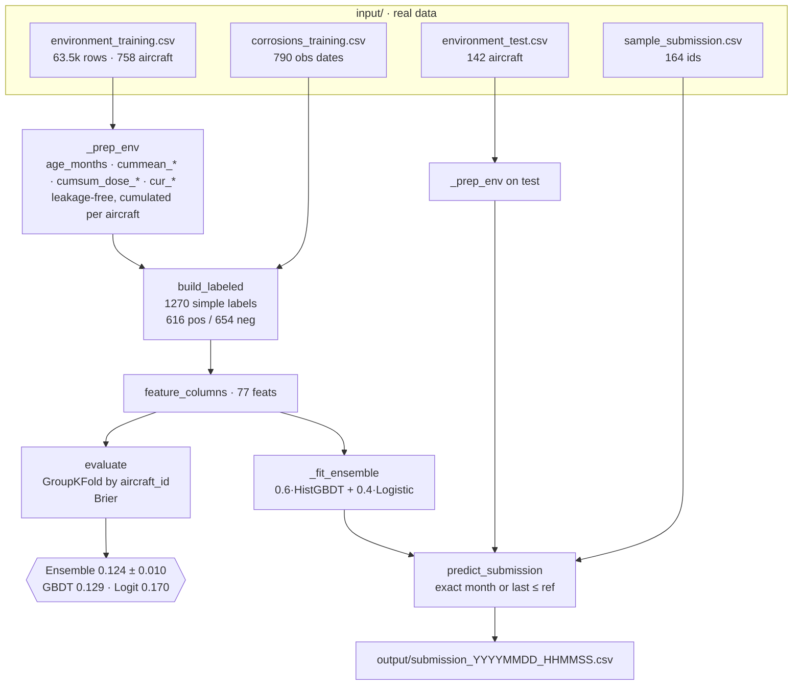
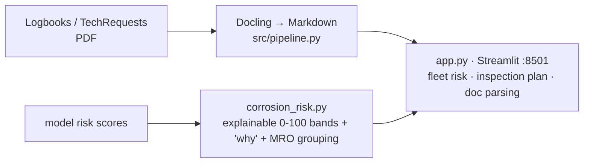

# Architecture — Wing Corrosion (HAKS 2026)

## Leaderboard pipeline (the scored path)

## Why this design
- **No temporal leakage:** every cumulative feature is computed up to and *including* the reference month only.
- **Anti-overfit validation:** GroupKFold by `aircraft_id` keeps an aircraft's +0 and −24 rows on the same side, so the model can't memorise per-aircraft and the Brier estimate is honest.
- **Signal = age + integrated dose** (Insight #2): the negative is 24 months younger with less accumulated corrosive exposure.

## Demo / pitch layer (planned, not scored)

