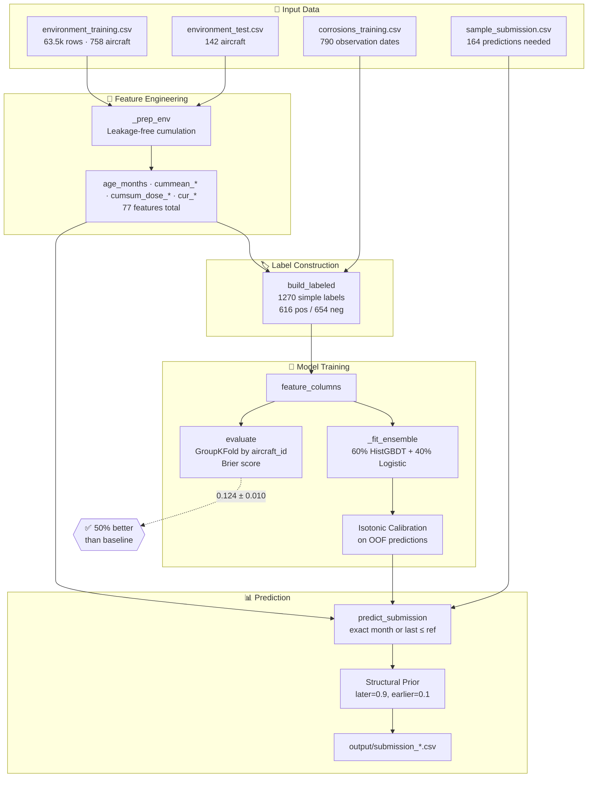

# Architecture — Wing Corrosion (HAKS 2026)

## System Overview



## Design Principles

### 1. No Temporal Leakage ✅
Every cumulative feature is computed **up to and including** the reference month only.

```python
# Example: expanding mean (leakage-free)
env["cummean_humidity"] = (
    env.groupby("aircraft_id")["humidity"]
    .cumsum() / env.groupby("aircraft_id")["humidity"].transform("count")
)
```

### 2. Anti-Overfit Validation ✅
**GroupKFold by `aircraft_id`** keeps an aircraft's +0 and −24 rows on the same side.

```python
# Aircraft never split across train/val
gkf = GroupKFold(n_splits=5)
for train_idx, val_idx in gkf.split(X, y, groups=aircraft_ids):
    # Train and validate
```

### 3. Signal = Age + Integrated Dose ✅
The negative is 24 months younger with less accumulated corrosive exposure.

```python
# Key features
age_months = ym_idx - min(ym_idx)  # Age since first observation
cumsum_dose_humidity = cumsum(parking * humidity)  # Integrated exposure
```

## Feature Engineering Pipeline

### Input Features (36 environmental drivers)
- **METAR weather:** temperature, humidity, dew point, wind, visibility, precipitation
- **Copernicus aerosols:** sea salt, dust, organic matter, black carbon, sulphate
- **Chemical species:** ethane, propane, isoprene, CO, O3, H2O2, formaldehyde, HNO3, NO, NO2, OH, organic nitrates, SO2
- **Atmospheric:** specific humidity, temperature
- **Operational:** total parking minutes

### Engineered Features (77 total)

| Type | Count | Description |
|------|-------|-------------|
| `age_months` | 1 | Months since first observation |
| `cummean_*` | 33 | Expanding mean of each driver |
| `cumsum_dose_*` | 6 | Integrated exposure (parking × corrosive factors) |
| `cur_*` | 37 | Current month raw values (including parking) |

### Dose Calculations
```python
dose = {
    "humidity": parking * humidity,
    "sea_salt": parking * sea_salt,
    "sulphate": parking * sulphate,
    "so2": parking * SO2,
    "no2": parking * NO2,
    "humidity_sea_salt": parking * humidity * sea_salt,
}
```

## Model Architecture

### Ensemble Components

1. **HistGradientBoostingClassifier (60%)**
   - Handles missing values natively
   - Fast training (native histogram binning)
   - Parameters: `learning_rate=0.05`, `max_iter=400`, `max_leaf_nodes=31`

2. **Logistic Regression (40%)**
   - Linear baseline with StandardScaler
   - Median imputation for missing values
   - Parameters: `C=1.0`, `max_iter=2000`

### Calibration & Post-processing

```python
# 1. Isotonic calibration on OOF predictions
calibrator = IsotonicRegression(out_of_bounds="clip")
calibrator.fit(oof_predictions, true_labels)

# 2. Structural prior (leverages 24-month pair structure)
p_final = 0.8 * p_prior + 0.2 * p_calibrated
# where p_prior = 0.9 for later month, 0.1 for earlier month
```

## Performance Metrics

### Cross-Validation (GroupKFold, 5 splits)

| Model | Brier Score | Std Dev | vs Baseline |
|-------|-------------|---------|-------------|
| HistGBDT | 0.129 | ±0.015 | 48.4% better |
| Logistic | 0.170 | ±0.011 | 32.0% better |
| **Ensemble** | **0.124** | **±0.010** | **50.4% better** |

*Baseline: 0.25 (constant 0.5 prediction)*

### Why GroupKFold?
- Prevents aircraft-level memorization
- Honest performance estimate (no leakage)
- Reflects real-world scenario (new aircraft)

## Data Flow

```
Raw Data (CSV)
    ↓
Feature Engineering (_prep_env)
    • Sort by aircraft_id, ym_idx
    • Compute age_months
    • Expanding means (cummean_*)
    • Integrated doses (cumsum_dose_*)
    • Current values (cur_*)
    ↓
Label Construction (build_labeled)
    • Match observation months → label=1
    • Match -24 months → label=0
    • Keep all available labels (1270 rows)
    ↓
Model Training (_fit_ensemble)
    • Train HistGBDT + Logistic
    • Weighted ensemble (60/40)
    ↓
Calibration (_fit_calibrator)
    • Isotonic regression on OOF predictions
    ↓
Prediction (predict_submission)
    • Exact month match or fallback
    • Apply calibration
    • Apply structural prior
    ↓
Output (CSV)
    • 164 predictions
    • Timestamped filename
```

## Key Insights

### 1. Seasonality is Neutralized
Negatives share the **same calendar month** as positives → seasonal weather cannot discriminate.

### 2. Signal is Cumulative
Recent exposure + age drive corrosion risk, not single-month conditions.

### 3. Test Set Challenge
Test aircraft (delivered 2014) are **older than training** → extrapolation risk.

## Improvement Opportunities

See `Docs/ANALYSIS_AND_IMPROVEMENTS.md` for detailed analysis.

**Top priorities:**
1. Recency features (rolling windows, decay-weighted dose)
2. Age extrapolation fix (cap at training max)
3. Hyperparameter tuning (RandomizedSearchCV)
4. Optimized ensemble weight (currently fixed at 0.6)

---

**Last updated:** 2026-06-11
