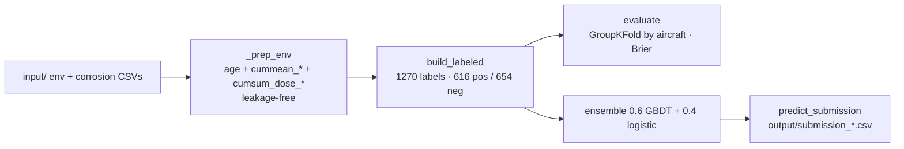

# PROJET IBM x AIRBUS — HAKS 2026 · Wing Corrosion (IBM × Airbus × AWS)

Predict `corrosion_risk` ∈ [0,1] per `(aircraft, reference month)`, scored by **Brier score**
(lower is better; constant-0.5 baseline = 0.25). Full project rules, data spec, the two
critical insights and the upgrade roadmap live in **[AGENTS.md](AGENTS.md)** (canonical).

## Quickstart
```bash
scripts/setup.sh           # create venv + install requirements.txt
scripts/run.sh cv          # grouped-CV Brier sanity check
scripts/run.sh submit      # write output/submission_YYYYMMDD_HHMMSS.csv
# direct equivalent: python src/corrosion_model.py [--submit]
```
Real data lives in `input/` (`environment_training.csv`, `corrosions_training.csv`,
`environment_test.csv`, `sample_submission.csv`).

## Pipeline

See [Architecture.md](Architecture.md) for the full diagram.

## Current results (GroupKFold by aircraft, baseline 0.25)
| model | Brier |
|---|---|
| HistGBDT | 0.129 ± 0.015 |
| Logistic | 0.170 ± 0.011 |
| **Ensemble** | **0.124 ± 0.010** |

## Conventions
Python · Streamlit · Docling (doc parsing, heavy → `requirements-docling.txt`). Always work
in `venv`, always test. Outputs are timestamped in `output/`. Trust grouped CV, not the
public leaderboard. macOS: Streamlit on port 8501 (never 5000). See [AGENTS.md](AGENTS.md).
